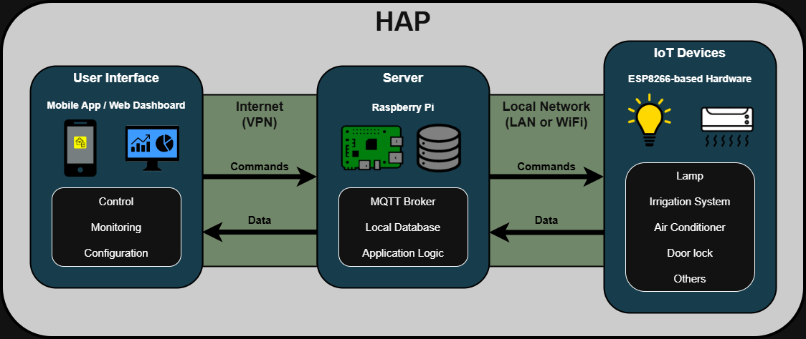

# Home Automation Platform (HAP)

A modular, self-hosted home automation platform focused on reliability, local control, and secure remote access.

The system is designed around a Raspberry Pi server that centralizes application logic and device state, ESP8266-based IoT modules for field control, and a mobile
application as the primary user interface. Communication between components is event-driven and optimized for embedded and low-latency environments.

---

## System Architecture



The platform follows a layered architecture:

- **User Interface Layer**: Mobile and web-based interfaces for monitoring and
  control.
- **Application Layer**: Centralized logic running on a Raspberry Pi server.
- **Device Layer**: Custom ESP8266-based hardware modules controlling actuators
  and sensors.

Remote access is secured using a VPN, allowing the system to remain fully functional without relying on external cloud services.

---

## Components Overview

### Mobile App / Web Interface
- Provides real-time monitoring and control of devices
- Sends user commands to the server
- Displays device states and sensor data

### Server (Raspberry Pi)
- Central application logic
- Device state management
- Local database storage
- MQTT-based device communication
- REST API for configuration and user interfaces

### IoT Devices (ESP8266)
- Custom-designed hardware modules
- Event-driven communication using MQTT
- Designed as lightweight, replaceable nodes
- Examples:
  - On/Off relay modules
  - Sensor modules
  - Air conditioner control modules

---

## Repository Structure

```
hap/
├── docs/       # Documentation, diagrams, images
├── firmware/   # ESP8266 firmware for IoT modules
├── hardware/   # PCB designs, schematics, manufacturing files
├── mobile/     # Android application
├── server/     # Core server logic and services
└── README.md
```

---

## Technology Stack

### Embedded & Hardware
- ESP8266
- C / Arduino framework
- Custom PCB design

### Server
- Raspberry Pi
- Python
- MQTT
- SQLite
- TCP/IP networking

### Mobile
- Android (Java)
- Local and remote control support

### Communication & Security
- MQTT for device communication
- REST API for configuration and UI interaction
- VPN-based secure remote access
- Local-first architecture (no cloud dependency)

---

## Communication Model

- Devices publish state changes and sensor data via MQTT
- The server processes events and applies application logic
- Commands are sent back to devices via MQTT topics
- The mobile app interacts with the server through secure API calls

---

## System Setup Steps

- Install a lightweight Raspberry Pi OS:
  - Raspberry Pi OS Lite (recommended)
  - Enable SSH during installation
  - Configure a static local IP address

- Update the system:
```
sudo apt update
sudo apt upgrade -y
```

- Install and configure GIT:
```
sudo apt install git -y
```

- Clone the repository:
```
git clone https://github.com/AlanCarvalhoEE/hap.git
```

- Enter project folder:
```
cd hap
```

- Edit your credentials:
```
cp server/scripts/credentials_example.py server/scripts/credentials.py
nano server/scripts/credentials.py
```

- Run setup.sh:
```
cd setup
chmod +x setup.sh
./setup.sh
```
  - The script will install all the needed packages, dependencies and services.

- Configure Mosquitto:
```
sudo nano /etc/mosquitto/mosquitto.conf
```
  - Include to the end of the file:
  ```
  listener 1883
  allow_anonymous true
  ```

- Restart Mosquitto:
```
sudo systemctl restart mosquitto
```

- Connect to your ZeroTier network (must be previously created on web browser):
```
sudo zerotier-cli join <network_id>
```
  - After zoining, the device must be allowed on the ZeroTier network dashboard.

- Reboot the Raspberry Pi:
```
sudo reboot now
```

---

## Current Status

- Core server architecture implemented
- Custom IoT ON-OFF module developed and tested
- Core Android application implemented
- Secure remote access functional

---

## Roadmap

Planned improvements:

- New custom IoT modules development
- Formal MQTT topic and message schema documentation
- Device auto-discovery and provisioning
- Improved fault tolerance and reconnection logic
- Automated testing for server-side logic
- Expanded mobile app features and UI refinement

---

## License

This project is currently intended for personal and educational use.
Licensing details may be defined in the future.